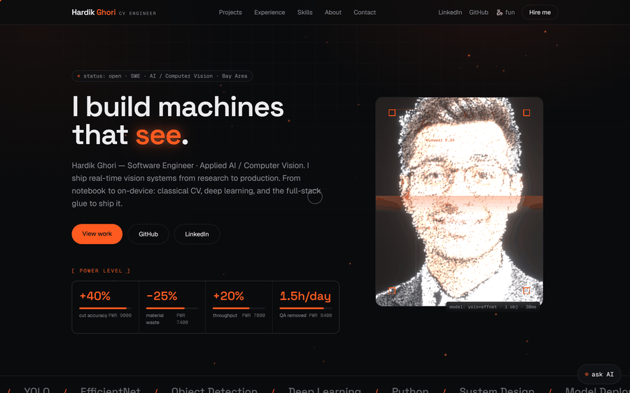
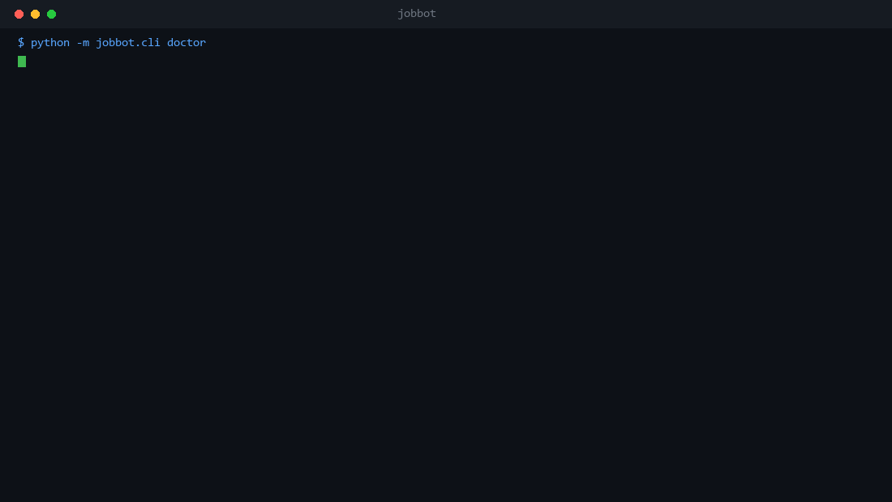
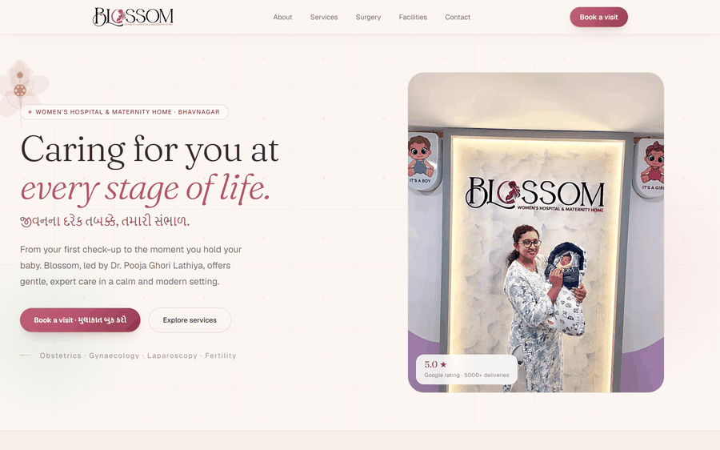

# Hi, I'm Hardik Ghori.

### Software Engineer & Applied AI · San Francisco Bay Area

**I take machine learning from research into production: real time computer vision, models that run on the device itself, and the full stack around them.**

M.S. Software Engineering, San José State University · Open to Software Engineer, Machine Learning and Applied AI roles

## Where I have worked

**Quesify** · Machine Learning Engineer, Applied Computer Vision · Nov 2025 to present 
Shipped a two stage YOLOv8 and EfficientNet pipeline that runs entirely on the phone, built the dataset pipeline behind it, and wrote the FastAPI services and React front end around it.

**San José State University** · Graduate Research Assistant, Applied AI and ML · Jan 2025 to Dec 2025 
Built Python pipelines over 500K records and cut preprocessing 35 percent, ran training and evaluation on GCP Vertex AI for an 18 percent accuracy gain, and designed LLM evaluation frameworks with A/B testing.

**LTIMindtree** · Software Engineer · Jan 2022 to Aug 2022 
Delivered backend features and REST integrations in Java and Python across 8 endpoints, improving service reliability 25 percent, and moved analytics onto Kafka and Spark streaming instead of overnight batch loads.

**Sparrow Softtech** · Software and Computer Vision Engineer · Aug 2020 to Dec 2021 
Put a Python and OpenCV inspection algorithm on a production laser line: cut accuracy up 40 percent, material waste down 25 percent, throughput up 20 percent.

Full detail, with every project and skill: **[github.com/hardikghori/resume](https://github.com/hardikghori/resume)**

## Featured work

### BugLite, venomous species identification with no signal required

A hiker or a farmer in rural North Carolina meets a snake or a spider and needs to know whether it is dangerous. There is no cell coverage where that happens, so the model runs on the phone.

The hard part was never the model. It was the data. Images had to be collected and named per species automatically, and the long tail of species barely appeared at all, so those classes were filled out with targeted augmentation until every one had enough to train on. A one percent stratified sample of each species was labelled by hand to seed it.

Detection and classification are split: a YOLOv8 detector finds the animal, an EfficientNet classifier names it, which keeps each model small enough to quantize. Input dimensions were cut for phone class hardware and the models exported through ONNX so one artefact serves both platforms inside a Flutter app, entirely offline. Accuracy landed at 87 percent.

Thresholds were tuned against false negatives rather than headline accuracy, because the errors are not symmetric. Calling a harmless rat snake venomous wastes somebody's afternoon. Missing a copperhead is the failure that matters.

### jobbot, a job search that runs itself

Sweeps around 11,000 job boards over plain HTTP, drops roughly 99 percent of postings through deterministic filters rather than model calls, picks the resume that matches what survives, tailors it per posting, then opens each application already filled in a real browser and stops with the submit button unclicked.

A form resolver classifies any field into a canonical class and answers about 85 percent of required fields with no model call, then verifies each one by reading the value back off the page. 724 tests. The submit click stays human, because that is the irreversible part and because a headless submit scores as a bot anyway.

One real run: 21 preflight checks, 253,167 postings read from 8,988 boards, 250,834 dropped on freshness alone, 89 percent of form fields answered without a model, 724 tests green. The source stays private, since it holds the profile and the application history it was built around.

### Travel Planner

[Repository](https://github.com/hardikghori/AI-trip-planner) · React, TypeScript, Supabase, Leaflet

Multi stop trip planning across 9 routes: search a destination, drag the stops into order on the map, and watch the end date and a six category budget estimate update as you go. Seven Postgres tables sit behind row level security so a user only ever reads their own rows, and sharing works through a token minted by a database trigger, which opens a read only itinerary for somebody with no account at all.

### Industrial diamond cutting vision system

Real time Python and OpenCV inspection deployed to a production laser line. Cut accuracy improved 40 percent, material waste fell 25 percent, throughput rose 20 percent, and roughly an hour and a half of daily manual quality checking disappeared.

### Blossom, two live maternity clinic builds

<table>
<tr>
<td width="50%" align="center">
<a href="https://blossom-womens-hospital.vercel.app/"><b>Women's Hospital</b></a> 

</td>
<td width="50%" align="center">
<a href="https://blossom-journey-of-life.vercel.app/"><b>The Journey of Life</b></a> 

</td>
</tr>
</table>

Case studies and live demos for everything above: **[hardik-ghori.vercel.app](https://hardik-ghori.vercel.app)**

## Also here

* **[Cover-Letter-App](https://github.com/hardikghori/Cover-Letter-App)** · generates a cover letter tailored to a specific role through an LLM workflow
* **[AI-Flight-Booking](https://github.com/hardikghori/AI-Flight-Booking)** · conversational flight booking that runs entirely in the terminal
* **[AI-Code-Comparison](https://github.com/hardikghori/AI-Code-Comparison)** · runs two models against the same task and compares what each produces
* **[Image_DWLD_AUG](https://github.com/hardikghori/Image_DWLD_AUG)** · parallel image collection and augmentation for building training sets

## Tech

| | |
|---|---|
| **Languages** | Python · Java · C and C++ · JavaScript and TypeScript · SQL |
| **AI and ML** | PyTorch · TensorFlow · OpenCV · YOLO · EfficientNet · ONNX · LLMs · LangChain · RAG · Scikit-learn |
| **Full stack** | React · Next.js · Node.js · FastAPI · Flask · Django · REST · GraphQL · Flutter |
| **Cloud and DevOps** | AWS · GCP Vertex AI · Docker · Kubernetes · Git · CI and CD with GitHub Actions and Jenkins · Linux |
| **Databases** | PostgreSQL · MySQL · MongoDB · Supabase · Redis · Pinecone |
| **Foundations** | Data structures · Algorithms · System design · OOP · Testing |

Software Engineer · Machine Learning Engineer · Computer Vision Engineer · Applied AI · San Francisco Bay Area · Open to work

